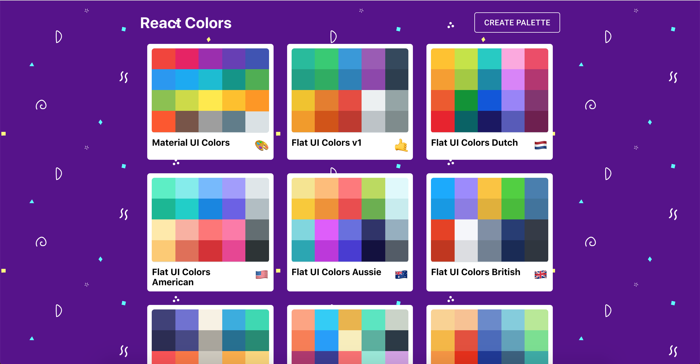
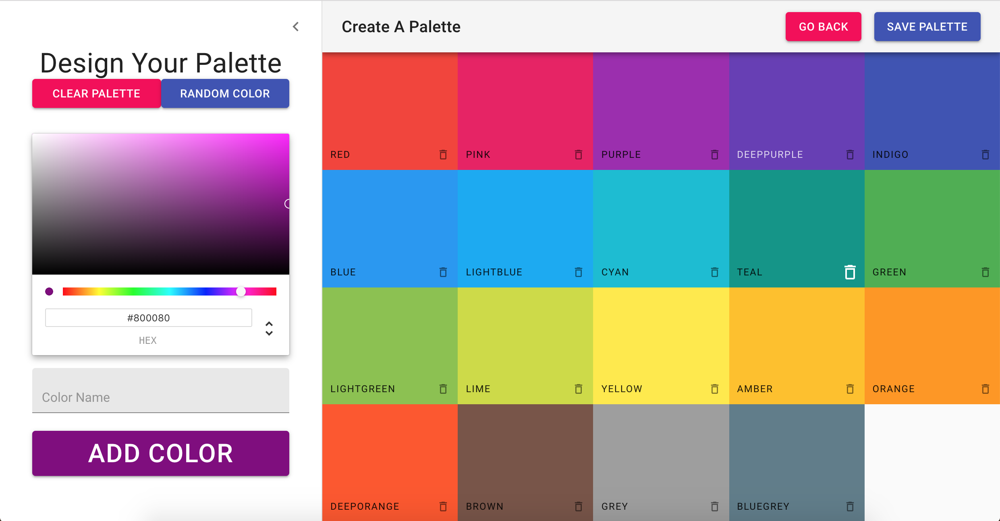
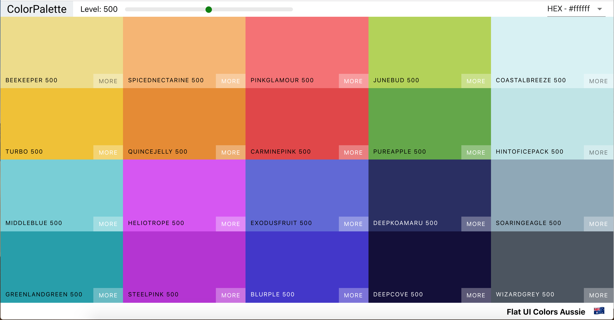
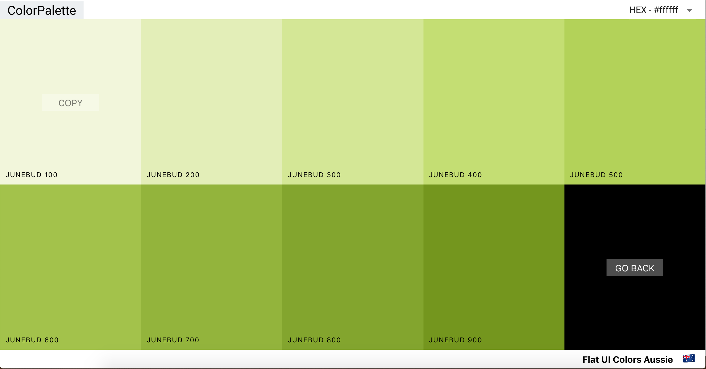
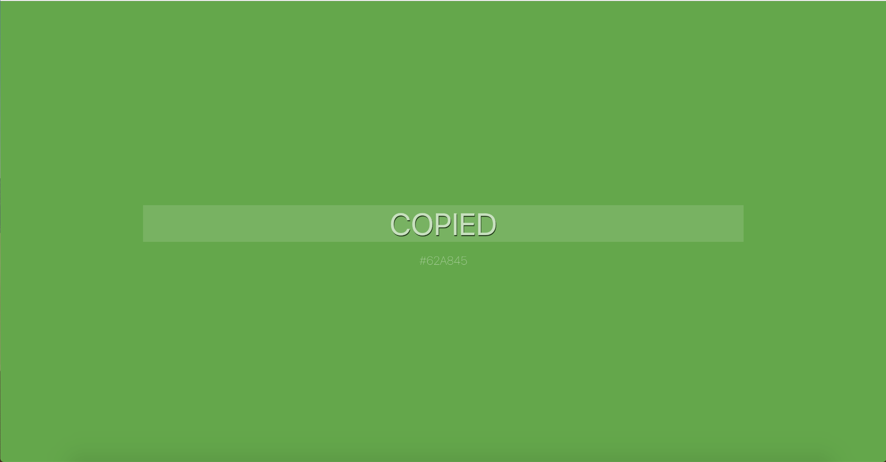

# color-palette
* You can view the website on https://meixuanc.github.io/color-palette/ or https://master.dj8bcfesocy8x.amplifyapp.com/
* A beautiful websites like [Flat UI Colors](flatuicolors.com) and [Material UI Colors](materialuicolors.co)
* Using React.js, Material-UI

* Support drag and drop in creating new palette page
* Support duplication detection of color, color name, and palette name
* Dynamically change the text color by the color luminance 

* Show different shade of colors by using the slider
* View all shades of a color by clicking more
* Clik the color box to copy the HEX, RGB, or RGBA code for using

---

## Run

In the project directory, you can run:

`npm install` `npm start`

Runs the app in the development mode. Open [http://localhost:3000](http://localhost:3000) to view it in the browser.

The page will reload if you make edits. 
You will also see any lint errors in the console.

## License

See the [LICENSE](License.md) file for license rights and limitations (MIT).